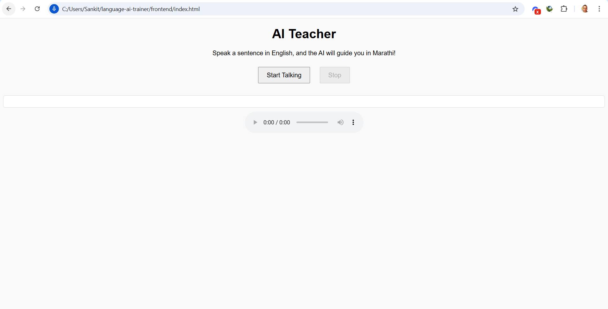

# **AI Teacher: Learn English with Marathi Instructions**

This AI-powered MVP (Minimum Viable Product) is designed to help users enhance their English-speaking skills through real-time, personalized feedback in Marathi. The application leverages state-of-the-art technologies to evaluate spoken English sentences, identify grammatical mistakes, and provide corrective suggestions in both text and audio formats. Perfect for language learners, educators, and anyone seeking to bridge the gap between English and regional languages, this solution emphasizes accessibility and practical learning.

---

## **Features**

- **Real-Time Speech-to-Text**:
  Converts spoken English into text using Whisper.
  
- **Grammar Correction**:
  Analyzes sentences for grammatical errors using LanguageTool.

- **Feedback in Marathi**:
  Provides clear and actionable feedback in Marathi, explaining mistakes and suggesting corrections.

- **Audio Feedback**:
  Converts Marathi feedback into audio for enhanced learning and accessibility.

- **Dynamic and Adaptive**:
  Works with any English sentence and dynamically generates appropriate feedback.

---

## **Setup Instructions**

### **Backend Setup**

1. **Create and Activate Virtual Environment**:
   ```bash
   python -m venv venv
   source venv/bin/activate  # For Linux/Mac
   venv\Scripts\activate     # For Windows
   ```

2. **Install Dependencies**:
   ```bash
   pip install -r requirements.txt
   ```

3. **Run the FastAPI Server**:
   ```bash
   uvicorn main:app --reload
   ```

4. **Access the API**:
   - Open [http://127.0.0.1:8000/docs](http://127.0.0.1:8000/docs) to view and test the API endpoints.

---

## **How It Works**

1. **User Input**:
   - Upload an audio file containing spoken English.

2. **Processing**:
   - **Transcription**: The audio is converted into text using Whisper.
   - **Grammar Analysis**: The text is analyzed for grammatical issues using LanguageTool.
   - **Feedback Generation**: Feedback is structured in Marathi, highlighting mistakes and providing suggestions.

3. **Output**:
   - **Text Feedback**:
     - English: Highlights grammatical mistakes.
     - Marathi: Provides corrections and explanations.
   - **Audio Feedback**: Converts Marathi feedback into an MP3 file for playback.

---

## **Frontend Instructions**

1. Open the `frontend/index.html` file in your browser.

2. Use the webpage interface:
   - **Record Your Voice**: Speak a sentence in English.
   - **Submit**: Click the submit button to send your recording to the backend for processing.

3. View the output on the webpage:
   - Transcription of your sentence.
   - Feedback in Marathi.
   - Audio playback of the Marathi feedback.

### **Sample Webpage Screenshot**


---

## **Example Console Output**

### **Audio Response**
You can find the generated audio response at the following location:
`backend/response_37.mp3`

### **Starting the Server**
```plaintext
(venv) C:\Users\Sankit\language-ai-trainer\backend>uvicorn main:app --reload
INFO:     Will watch for changes in these directories: ['C:\\Users\\Sankit\\language-ai-trainer\\backend']
INFO:     Uvicorn running on http://127.0.0.1:8000 (Press CTRL+C to quit)
INFO:     Started reloader process [29652] using StatReload
```

### **Warnings from Dependencies**
```plaintext
C:\Users\Sankit\language-ai-trainer\venv\lib\site-packages\whisper\__init__.py:150: FutureWarning: You are using `torch.load` with `weights_only=False` (the current default value), which uses the default pickle module implicitly. It is possible to construct malicious pickle data which will execute arbitrary code during unpickling (See https://github.com/pytorch/pytorch/blob/main/SECURITY.md#untrusted-models for more details). In a future release, the default value for `weights_only=True` will be flipped to `True`. This limits the functions that could be executed during unpickling. Arbitrary objects will no longer be allowed to be loaded via this mode unless they are explicitly allowlisted by the user via `torch.serialization.add_safe_globals`. We recommend you start setting `weights_only=True` for any use case where you don't have full control of the loaded file. Please open an issue on GitHub for any issues related to this experimental feature.
  checkpoint = torch.load(fp, map_location=device)
C:\Users\Sankit\language-ai-trainer\venv\lib\site-packages\whisper\transcribe.py:126: UserWarning: FP16 is not supported on CPU; using FP32 instead
  warnings.warn("FP16 is not supported on CPU; using FP32 instead")
```

### **Server Initialization**
```plaintext
INFO:     Started server process [2320]
INFO:     Waiting for application startup.
INFO:     Application startup complete.
```

### **Processing Input**
#### **Example Input**:
- The user speaks: **"I going to school."**

#### **Output in Console**:
```plaintext
Transcription:  I going to school.
Grammar Feedback (English): An auxiliary verb seems to be missing from this progressive structure. Did you mean “I'm going”, “I am going”, or “I was going”?. Use 'I'm going'.
Marathi Feedback: तुझ्या वाक्यात त्रुटी आहेत. ' I going to school.' असे म्हणण्याऐवजी, 'I'm going' असे म्हणायला पाहिजे.
Audio Response Saved as: response_37.mp3
```

### **Final Request Log**
```plaintext
INFO:     127.0.0.1:51053 - "POST /ai_teacher/ HTTP/1.1" 200 OK
```

---

## **Example API Usage**

#### **Endpoint**: `/ai_teacher/`

- **Method**: POST
- **Description**: Upload an audio file and receive grammar feedback in Marathi (text and audio).

#### **Sample Request**:
Using `curl`:
```bash
curl -X POST "http://127.0.0.1:8000/ai_teacher/" \
-F "audio_file=@path_to_audio_file.wav"
```

#### **Sample Response**:
```json
{
  "transcription": "I going to market.",
  "feedback": {
      "english": "An auxiliary verb seems to be missing. Use 'I am going'.",
      "marathi": "तुझ्या वाक्यात त्रुटी आहेत. 'I going to market' असे म्हणण्याऐवजी, 'I am going to market' असे म्हणायला पाहिजे."
  },
  "audio_file": "response_26.mp3"
}
```

---

## **File Structure**

```plaintext
ai-teacher/
├── backend/
│   ├── main.py               # FastAPI backend entry point
│   ├── requirements.txt      # Python dependencies
│   ├── models/               # Pretrained models and utilities
│   │   ├── whisper_model.py  # Whisper Speech-to-Text wrapper
│   │   ├── translation.py    # MarianMT Translation utilities
│   │   ├── grammar_check.py  # LanguageTool grammar checking utilities
│   │   ├── tts.py            # gTTS text-to-speech utilities
│   └── temp/                 # Temporary storage for audio files (gitignored)
│
├── frontend/
│   ├── index.html            # HTML for the web app
│   ├── style.css             # CSS styling for the web app
│   ├── app.js                # JavaScript logic for the web app
│   └── assets/               # Static assets (images, icons, etc.)
│
├── .gitignore                # Git ignore file for temp files and virtual environment
├── README.md                 # Documentation for the project
└── start.sh                  # Script to start both backend and frontend
```

---

## **Key Libraries Used**

1. **[Whisper](https://github.com/openai/whisper)**:
   - For accurate speech-to-text transcription.

2. **[LanguageTool](https://github.com/languagetool-org/languagetool)**:
   - For grammatical analysis and error identification.

3. **[Hugging Face Transformers](https://huggingface.co/)**:
   - Specifically, MarianMT for translating feedback into Marathi.

4. **[gTTS](https://pypi.org/project/gTTS/)**:
   - For converting Marathi feedback into speech.

5. **[FastAPI](https://fastapi.tiangolo.com/)**:
   - For building and serving the API.

---

## **Future Enhancements**

### **Real-Time Interaction**
- Integrate with a web or mobile app for live feedback.

### **Additional Languages**
- Add support for feedback in Hindi, Tamil, or other regional languages.

### **Improved Voice Quality**
- Use advanced TTS APIs like Google Cloud TTS for natural-sounding feedback.

### **Custom Grammar Rules**
- Tailor grammar feedback for Indian English speakers.

### **Expanded Functionalities**
- Include sentence rephrasing suggestions for better clarity.

### **User Progress Tracking**
- Add features to track and display user improvements over time.

### **Interactive Tutorials**
- Provide step-by-step exercises to enhance grammar and vocabulary.

---

